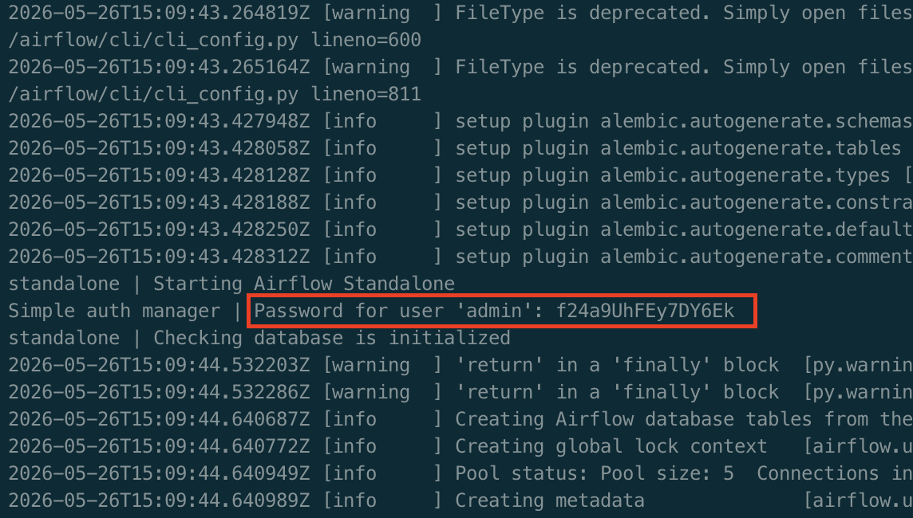

Airflow standalone Docker images
================================

Standalone Apache Airflow Docker image for development and testing.

## Spark

A Docker image containing [Apache Spark](https://spark.apache.org).
Based on the [docker-airflow-spark](https://github.com/pyjaime/docker-airflow-spark) image.

Running:

- Run the following command: `docker run -p 8080:8080 -d segence/docker-airflow-standalone:0.5.0-spark`
- In the logs, find the line that says `Password for user 'admin'` 
